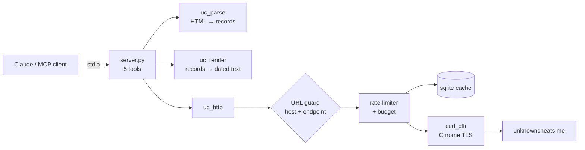

<div align="center">

# uc-mcp

**Search UnknownCheats from Claude Code, with a date on every result.**

A read-only [MCP](https://modelcontextprotocol.io) server that gives Claude
(or any MCP client) search and thread reading on the UnknownCheats forum
through your own logged-in session. It marks every result with its age,
because on this forum an old answer is usually a wrong one.

[](https://github.com/0111-0222/uc-mcp/actions/workflows/ci.yml)
[](https://www.python.org)
[](https://modelcontextprotocol.io)
[](https://code.claude.com/docs)
[](#account-safety)
[](#install)
[](https://github.com/astral-sh/ruff)
[](LICENSE)

[Install](#install) · [Cookies](#2-export-your-cookies) · [Usage](#usage) ·
[Account safety](#account-safety) · [Troubleshooting](#troubleshooting)

</div>

---

```text
UC search: "entity list" · threads · sorted newest · 23 total · page 1/2 · 3 threads
now=2026-09-30 12:00Z · all dates UTC · (age) after each date

 1. 2026-09-28 (2d)  [Coding] Entity list walker for the current build
    example-game/2000101-entity-list-walker.html  ·  by carol_sdk  ·  41 replies, 6.2k views · 3pg
 2. 2025-11-02 (10mo)  [Question] Entity list pointer changed after update
    example-game/2000102-entity-list-pointer-changed.html  ·  by erin  ·  12 replies, 1.9k views
 3. 2019-03-14 (7.5y)  [Release] Entity list dumper  <- ANCIENT
    example-game/2000103-entity-list-dumper.html  ·  by frank  ·  88 replies, 31k views · 5pg
```

## Why

Public docs on game hacking, anti-cheat and reverse engineering are thin,
stale or wrong. The current answers are on UnknownCheats, and a model can't
read it without an account. This server lets it read the forum with yours,
and puts dates first:

- **Every row carries a date and an age.** Dates are converted to UTC from the
  forum's own timezone.
- **Stale content is labelled** `<- OLD` / `<- ANCIENT`, with a warning line
  the model can't skim past. Offsets and signatures die on a game patch; a
  bypass dies when the anti-cheat ships a detection.
- **Long threads point to their last page.** Page 1 of a ten-year thread is
  usually worthless.
- **Code blocks survive intact** (on this forum the code *is* the answer), and
  quote chains collapse to one line.
- **Output is compact text, not JSON**, so results cost fewer tokens.

## Install

You need **Python 3.10+**, an **UnknownCheats account**, and
**[Claude Code](https://code.claude.com/docs)** (or another MCP
client).

### 1. Clone and install

```bash
git clone https://github.com/0111-0222/uc-mcp.git
cd uc-mcp
```

**Windows (PowerShell):**

```powershell
.\install.ps1
```

**macOS / Linux:**

```bash
./install.sh
```

The script creates `.venv`, installs the dependencies, creates `cookies.json`
from the example, and prints the exact command to register the server.

<details>
<summary>Using <code>uv</code> instead</summary>

```bash
uv sync
cp cookies.example.json cookies.json
claude mcp add --scope user unknowncheats -- uv run --directory "$PWD" server.py
```

</details>

### 2. Export your cookies

1. Log into [unknowncheats.me](https://www.unknowncheats.me/forum/) in your
   normal browser.
2. Install a cookie exporter such as
   [Cookie-Editor](https://cookie-editor.com), open it on the UC tab and choose
   **Export → Header String**.
3. Paste that string into the `cookie` field of `cookies.json`.
4. Copy your browser's User-Agent (search "what is my user agent") into
   `user_agent`.

```json
{
  "cookie": "bbsessionhash=…; bbuserid=…; cf_clearance=…; bblastvisit=…",
  "user_agent": "Mozilla/5.0 (Windows NT 10.0; Win64; x64) AppleWebKit/537.36 …"
}
```

| Cookie | Needed | Why |
| --- | --- | --- |
| `cf_clearance` | **yes** | The site is behind Cloudflare. It is tied to the IP and User-Agent it was issued to, which is why step 4 matters. |
| `bbsessionhash` | **yes** | Search and most boards require a login. |
| `bbpassword` | **no, delete it** | vBulletin's persistent auto-login token. It gives long-lived access to your account, and you don't want that sitting in a file. |

`cookies.json` is gitignored. To keep it somewhere else, set `UC_MCP_COOKIES`
to its path.

### 3. Register with Claude Code

Use the command the install script printed (absolute paths). It looks like:

```bash
claude mcp add --scope user unknowncheats -- "/path/to/uc-mcp/.venv/bin/python" "/path/to/uc-mcp/server.py"
```

On Windows the interpreter is `.venv\Scripts\python.exe`. `--scope user` makes
the server available in every project. Remove it with
`claude mcp remove unknowncheats`.

<details>
<summary>Claude Desktop, Cursor, and other MCP clients</summary>

Add this to the client's MCP config (`claude_desktop_config.json`,
`.cursor/mcp.json`, …):

```json
{
  "mcpServers": {
    "unknowncheats": {
      "command": "C:\\path\\to\\uc-mcp\\.venv\\Scripts\\python.exe",
      "args": ["C:\\path\\to\\uc-mcp\\server.py"]
    }
  }
}
```

</details>

### 4. Check it

Start Claude Code and ask:

> call uc_session with reload=True

You should see `session : logged in, Cloudflare passed`.

## Usage

Just ask. The tool descriptions already tell the model to reach for UC on
game-hacking, anti-cheat and RE questions:

> What's the current way people are getting the entity list in Rust? Only trust stuff from the last 6 months.

> Find the canonical thread on manual mapping and summarize the newest page.

> List the Valorant subforum and tell me what's active this week.

### Tools

| Tool | What it does |
| --- | --- |
| `uc_search(query, forum, since, sort, mode, title_only, page, limit)` | Keyword search. `mode="threads"` gives one row per thread (best for finding the definitive thread); `mode="posts"` gives individual dated posts with snippets. |
| `uc_thread(path, page, chars)` | Read a thread's posts. `page="last"` jumps to the newest. |
| `uc_forum(slug, page, limit)` | No slug: every subforum and its slug. With a slug: that board's threads. |
| `uc_fetch(path, chars)` | Fallback: any forum page as cleaned text. |
| `uc_session(reload, clear_cache)` | Session health, request budget, cache. `reload=True` re-reads `cookies.json`. |

### Searching well

vBulletin ORs loose terms and stops counting at 500, so **extra words widen
the search instead of narrowing it**. A long natural-language query just
returns the forum's newest posts. Measured on one query:

| Query | Result |
| --- | --- |
| `"manual map" injection detection` | 500 (cap). Top hits were about YOLO mouse input and Arduino colorbots |
| `"manual mapping"`, `mode="threads"`, `title_only=True` | 105 threads, every title on topic |
| ...plus `forum="anti-cheat-bypass"` | 23 |
| ...plus `forum="rust"` | 2 |

So: one `"quoted phrase"`, `mode="threads"` with `title_only=True` first,
`forum=` to scope it, and post mode only if that finds nothing. A header
reading `500+ (result cap)` means the ranking is meaningless, and the tool
says so.

### Making it the first stop

To make "check UC first" a hard rule in a project, add this to its
`CLAUDE.md`:

```markdown
## Game hacking / anti-cheat / RE questions
Before answering from memory or searching the web, call `uc_search` first.
Public documentation on these topics is thin, stale, or wrong. Check the dates
on what comes back: anything older than a year is reference-only — the method
may hold, the offsets and signatures will not.
```

## Account safety

This server uses **your** logged-in session, so it's built to behave like a
careful human reader and to never put the login at risk.

**What it will never do**

- **Write anything.** No tool can post, reply, rate, report, subscribe or PM.
  Account and posting endpoints (`login.php`, `private.php`, `newreply.php`,
  `profile.php`, `usercp.php`, `attachment.php`, anything carrying a
  `securitytoken` or `logouthash`, …) are refused before a request is made.
- **Send your cookies anywhere but unknowncheats.me.** Forum posts are
  attacker-controlled text, and a post can try to talk the model into fetching
  a link. Every URL is parsed, not string-matched, so look-alikes such as
  `https://evil.com?.unknowncheats.me/` are rejected. The cookies are also
  pinned to the `.unknowncheats.me` domain inside curl itself, so even a
  redirect can't carry them off-site. Both guarantees are covered by tests.
- **Follow instructions from posts.** Every result is marked as untrusted
  third-party data.

**How it keeps traffic human-shaped**

| Control | Value | Why |
| --- | --- | --- |
| Between searches | 17s + up to 2s jitter | The forum enforces 15s between searches and rejects anything faster. |
| Between page reads | 4s + jitter | Reads are cheap; paying the search price would make threads unusable. |
| Hourly cap | 150 requests | Keeps sustained use from looking like a scraper. |
| Daily cap | 1000 requests | Same. |
| Jitter | 0–2s random | Exactly periodic requests are a bot signature. |
| TLS | Chrome impersonation | Handshake matches a real browser, with your real User-Agent. |

The limits are process-wide, and the last send time is kept on disk, so a new
Claude Code session can't fire straight into the forum's throttle. Pages are
cached in `.cache/uc.sqlite3` (threads and searches 15 min, forum listings 10,
the board index 6 hours), and paging a search re-uses its server-side
`searchid`, so going back to a result costs one cheap read, not a new search.

**What's on you**

- **Never share `cookies.json`**, and never paste it, a `Cookie:` header or a
  HAR file into an issue, a chat or Discord. Anyone holding it is you on the
  forum. Everyone who uses this runs it with their **own** account.
- **Leave `bbpassword` out** of the export (see [cookies](#2-export-your-cookies)).
  `uc_session` tells you if it's there.
- **Know the risk.** Automated access to a logged-in account always carries
  some ban risk, and the forum's rules are the forum's call. The limits above
  are mitigation, not a guarantee. Use it the way you'd read the forum
  yourself.

## Troubleshooting

| Symptom | Fix |
| --- | --- |
| `Cloudflare blocked the request` | `cf_clearance` expired (it can be short-lived) or was issued to another IP/User-Agent. Refresh the forum in your browser, re-export into `cookies.json`, then ask Claude to call `uc_session(reload=True)`. No restart needed. |
| `session is browsing as a guest` / `Redirected to login` | `bbsessionhash` is missing or expired. Re-export as above. |
| `local budget spent` | The hourly or daily cap was hit. Wait; the message says which. |
| `the forum's own search throttle rejected this` | Another search (maybe from your browser) went out less than 15s ago. Retry shortly. |
| `no subforum slug "..."` | Use the URL segment, not the display name. `uc_forum()` with no argument lists them. |
| `500+ (result cap)` in a search header | The query saturated. See [Searching well](#searching-well). |
| Server not showing up in Claude Code | Register with **absolute** paths, and check with `claude mcp list`. |

## How it works



Three things are load-bearing, each verified against the live site:

- **`curl_cffi` with Chrome impersonation, not `httpx` or `requests`.** The
  Cloudflare WAF fingerprints the TLS handshake. A plain Python client gets a
  hard 403 no matter how correct the cookies are.
- **Search is a POST with a `securitytoken`.** A GET against
  `search.php?do=process` doesn't run a search on this vBulletin. The token is
  scraped, cached, and refreshed automatically if rejected.
- **Selectors are confirmed against real authenticated HTML.** UC runs a
  vBulletin 3-era template set: `td[id=f<id>]` for boards, `td[id=td_threadtitle_<tid>]`
  for thread rows, `table[id=post<pid>]` + `div[id=post_message_<pid>]` for
  posts.

| File | Role |
| --- | --- |
| [`server.py`](server.py) | The five MCP tools and their argument handling |
| [`uc_http.py`](uc_http.py) | URL guard, cookie jar, rate limiter, budget, sqlite cache |
| [`uc_parse.py`](uc_parse.py) | vBulletin HTML → threads, posts, search hits |
| [`uc_render.py`](uc_render.py) | Records → compact, dated, staleness-labelled text |
| [`uc_dates.py`](uc_dates.py) | Forum date formats → UTC, ages, rot tiers |

### Configuration

| Env var | Default | Purpose |
| --- | --- | --- |
| `UC_MCP_COOKIES` | `./cookies.json` | Where your exported cookies live |
| `UC_MCP_CACHE` | `./.cache/uc.sqlite3` | Page cache and request ledger |

## Development

```bash
pip install -r requirements.txt pytest ruff
pytest        # offline: synthetic fixtures + a loopback server, no forum traffic
ruff check .
```

The test suite never touches the forum. Parsers run against hand-written
fixtures that mirror UC's markup, and the cookie-pinning test points both
`www.unknowncheats.me` and a look-alike host at a local server to check which
one gets the login.

## License

[MIT](LICENSE). Not affiliated with UnknownCheats. You are responsible for how
you use your account.
